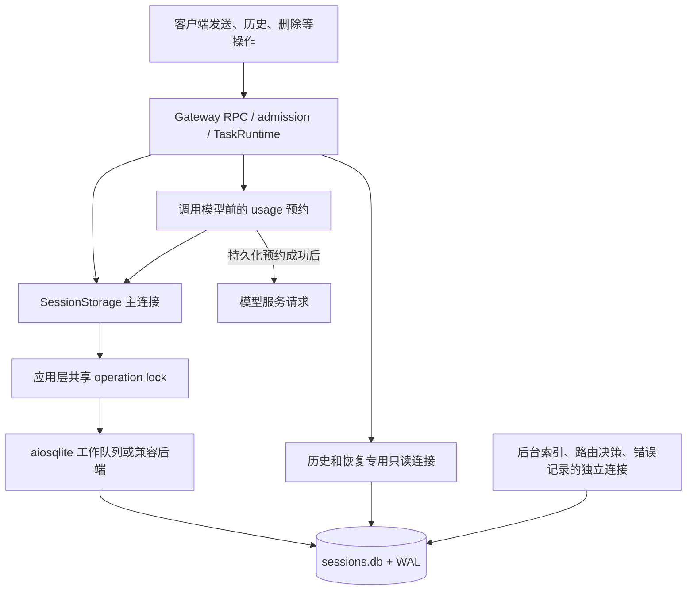

# 客户端数据库链路审计与诊断方案

审计日期：2026-09-29。审计基线：`11512cb1a`，当时产品源码与上一轮验证的 `4c2409aae` 相同。第 1–9 节保留审计事实与分阶段计划（源码行号对应审计基线）；第 10 节记录随后已实施的 P0 诊断和验证。没有更改锁、超时、业务 SQL、索引、事务语义或真实用户数据。

目标不是让错误计数消失，而是解释：**哪项用户操作在什么生命周期阶段，等待了谁、多久；是否已提交；是否发送过模型请求；最小改动如何减少等待而不破坏数据。** 每项结论都要区分源码事实、隔离机制复现、原生包验收与原用户现场。

## 1. 当前架构：有多种连接与等待



这张图没有把任务执行锁、会话生命周期门禁、恢复读取调度器画成数据库锁；它们是更上层、需要单独记录的等待。`sessions.db` 外还存在 scheduler、process owner、memory 等存储，不共享这一个 Python 锁，但可能竞争同一磁盘、线程池或事件循环。

| 层次 | 当前机制 | 诊断中不能混淆的地方 |
|---|---|---|
| 用户操作与任务 | RPC 接受、任务排队、会话代际和执行门禁 | 用户点击至返回不全是数据库耗时；accepted 后的执行失败与未接受不同 |
| 主连接应用锁 | `SessionStorage._operation_lock` 串行化该连接上的事务和部分读取 | 锁只管理这个实例/连接，不能代表同文件的所有写者；部分读也占此锁 |
| 专用读路径 | WAL 正常路径使用 transcript/recovery `query_only` 连接；失败或特定路径会使用主连接 | 不能宣称所有读写都已隔离；还要记录选中的实际路径与降级原因 |
| 工作线程 | aiosqlite 每连接通过工作线程队列执行；兼容后端还有连接锁与 executor | await 时间包含队列、原生调用和完成回到事件循环的延迟，不等于纯 SQL 时间 |
| SQLite 写者 | 同一数据库写入需要协调，主连接以 `BEGIN IMMEDIATE` 开始写事务 | 其他连接即使没有拿 Python 锁，仍可占 SQLite 写者位置 |
| 提交与文件系统 | commit、WAL、checkpoint、同步写及文件 I/O | commit 慢不能仅凭墙钟判断为 SQL 慢或杀毒干扰；必须进一步分段 |
| 调度与结果 | 取消收敛、结果解码、RPC 编码和 UI 应用 | 超时/取消不代表已经排入线程的 SQL 停止，也不必然代表未提交 |

SQLite 的单写者与 WAL 读写并发边界见 [官方隔离说明](https://www.sqlite.org/isolation.html)；每连接工作线程与请求队列见 [aiosqlite 官方文档](https://aiosqlite.omnilib.dev/en/stable/)。这些是库机制，具体走哪条路径仍以包内实现为准。

## 2. 两秒究竟限制什么

`storage.py:388,2272` 保留约 2 秒交互 busy budget。一次 `_write_transaction` 在申请应用锁之前建立 deadline，申请锁、`BEGIN IMMEDIATE` 与 commit 遇到 SQLite BUSY 时复用该预算。事务 SQL 主体没有统一的两秒执行中断；已排入线程的工作还要完成或安全回滚。因此它不是“数据库事务必须两秒内结束”。

`usage_ledger_runtime.py:233,270` 的调用模型前预约，默认还允许一次 100ms 后重试。实际请求可以经历多次存储尝试及其他工作，不能宣传“两秒封顶”，也不能把所有重试加一个固定数当作用户延迟。

恢复读取另有从调度入口传播的 deadline；其队列预算、读锁预算与普通写入预算不同。诊断要同时记录端到端请求、每次尝试和实际余下预算，不给每一层重新发一份完整预算来掩盖累计等待。

## 3. 已确认、尚未确认

| 发现 | 证据等级 | 对后续工作的含义 |
|---|---|---|
| 很多短预约累计排队也会超时 | 已有真实 SQLite 隔离实验：2–512 突发梯度成功，2048 突发出现失败 | 说明机制成立，不是用户真实并发容量，也不证明这是现场主因 |
| 重历史删除会占据写通道 | 十万条 transcript 删除持锁约 977ms，包含 DELETE/FTS 工作与 commit；已命中现有索引 | 不能简单归因缺索引，也不能随意拆开原子删除 |
| identity 索引未就绪可放大预约耗时 | 十万 sessions 的对照中，调用已有索引准备后，归属 SELECT 由约 14.71ms 降到 0.016ms；128 预约由 19 次超时变为全成功 | 候选是关键索引准备顺序/失败恢复；不是一律新增索引 |
| 现有复杂 lab 缺少“索引未就绪/补账中”状态 | 本轮读取已有关闭状态的 B 批数据库备份：约 140MB、141 个索引，三项目标索引都存在，identity 查询命中索引，补账状态 complete | 225 万文件不能代替数据库升级竞争；需要同规模不同生命周期的合成副本 |
| 慢 owner 登记和 session 物理清理不再长时间卡 loop | 上轮真实 frozen A/B 已证实两条路径的 loop 停顿由秒级降至十几毫秒 | 它们不等于 sessions.db 排队已变短；物理清理本来就在主删除事务之外 |
| ArtifactSession 等读取仍占主连接锁 | `artifact_session/repository.py:313` → `storage.py:2316` 的 `read_transaction` | 需要查共享读取是否占住前台写通道，不能只看写操作 |
| 同库存在主连接以外的写者 | `boot.py:3495–3548` 为路由决策和错误记录传入 sessions.db；`storage.py:2493` 用独立连接创建后台索引 | SQLite BUSY 可能来自本进程另一条连接；正常路由/错误记录已有 off-loop 路径，不能仅凭同步 API 宣称堵 loop |
| 日志缺少部分持有者和降级信息 | `read_transaction` 未用 `_observe_operation`；普通 extra/文本日志不进入安全 metadata | 必须先修诊断缺口，否则无法完整归因 |

已有实验明细为本地 `reports/gateway-scale-lab/storage-contention-diagnosis-20260929.md`；它不是用户现场复现。原生正常启动/重启的十对 A/B 没有证明普遍提速，见 [性能对照](PERFORMANCE-2026-09-29.zh-CN.md)。

## 4. 先补的诊断缺口

### 4.1 已经验证的日志缺口

1. `storage.py:2326` 的共享读取会持有 `_operation_lock`，但未登记 `_operation_holder`，其自身申请锁也没有相同的两秒等待规则。故日志 holder 为空不代表没有占锁者；先补观测，不顺手改变读操作期限。
2. `storage.py:1933` 的 reader fallback 使用普通 `extra`；rollback failure 使用普通文本日志。`log_privacy.py:147` 只投影 `_opensquilla_log_metadata`。本轮真实 formatter 内存探针确认两者都退成 `unstructured_log`，事件类型与原因缺失；结构化 busy 对照保留正常。
3. 当前 timeout 记录只快照最后一位 holder。等待期间可能已经经过几十笔短事务，不能把全程等待归给报错时那一笔。
4. 主连接 holder 记录不覆盖后台 DDL、路由或错误 writer；没有 SQL 工作线程进出边界时，await 时间也无法区分执行与调度。

formatter 证据：`.cache/database-audit-runtime-20260929/log-projection.json`。修复应复用安全的 event、operation、reason_code、phase、exception_type 和数值字段，不把异常全文、SQL 参数或用户消息加入日志；验证最终写出的日志和支持包，而不只验证 logger 调用参数。

### 4.2 分两层采集，避免诊断本身制造排队

**实验层先行**：先用隔离 probe 记录应用锁的入队、取得、释放，以及 BEGIN/commit 的总等待。只有 P0 证明时间主要消耗在连接 worker 后，才在实验脚本中增加 `worker_start/worker_end`；私有工作队列接口不进入产品依赖。

**产品层只补必要证据**：先补缺失的安全日志投影、持有者标记和分阶段汇总。仅当原生场景无法归因时才加入默认关闭、有边界的本地 recorder；不接 telemetry、不新增上报服务、不引入通用数据库追踪框架。

首轮产品证据只要求 RPC、应用锁、BEGIN/commit、结果状态五个边界；以下更细的 worker 和 loop 边界按证据逐步开启。所有时间点采用同进程高分辨率单调时钟；墙钟只用于对齐不同进程的大致窗口：

| 时间段 | 最小记录 | 能回答什么 |
|---|---|---|
| RPC/任务进入 → 存储尝试 | 临时关联序号、操作种类、前台/后台分类、attempt、实际预算 | 延迟是否已经发生在存储之前，是否有重复尝试 |
| 申请应用锁 → 获得锁/取消/超时 | connection generation、waiter 数、holder 序号与边界 | 哪一条应用队列拥堵，长 holder 还是许多短 holder |
| 提交 SQL 工作 → worker 开始 | 连接角色、固定语句类别、提交与开工时间 | 工作线程或 executor 是否排队 |
| worker 开始 → 原生调用完成 | execute/fetch/commit/rollback 分类、错误代码、受影响行数 | SQL/SQLite 锁等待/提交的实际原生调用成本；BUSY 要单独标记 |
| 原生完成 → await 恢复 | 两个时间点，独立 loop lag | SQL 已结束而 loop 还没调度回来，避免误判 SQL 慢 |
| BEGIN/主体/commit/rollback → 释放锁 | 持锁时间、重试数、阶段、事务状态、取消状态 | 锁究竟花在哪里，是否为取消后的安全收敛 |
| 数据库结果 → 用户结果 | accepted、receipt/任务状态、Provider 请求次数、业务结果 | 消息有没有接受、模型有没有调用、是否只是当前请求失败 |

阶段有包含关系：hold 包含其内部 worker 等待和 SQL，loop lag 是旁证，不能再次相加。等待期间所有持有者区间按时间交集归因；缓冲截断或存在未观测区间时明确标记 incomplete，不靠最后 holder 猜测。

优先采用现有请求关联信息在内存中建立映射，对外只保留测试自有序号、固定枚举和数值。记录连接角色及代次，避免不同数据库/连接或重连后的事件串错。禁止记录完整 SQL、绑定参数、原始路径、消息、token 和自由异常文本。限制缓冲容量、事件数、单次运行时长与文件大小，计数记录 dropped events。

先校验观测误差：对同一合成场景做计时关闭/开启的交错重复；记录 CPU、峰值内存、日志量及延迟差。若观测改变吞吐、故障是否出现或明显放大延迟，先缩减采集，不能用被观测器制造的拥堵指导产品修改。Windows 下短间隔 timer 有分辨率边界，不能将未见尖峰解释成没有尖峰。

## 5. 复现矩阵：从正常行为到单一干扰

不做所有因素的笛卡尔积。首轮只执行 D0、D1、D2、D4；D3、D5、D6 只有在前一轮出现对应信号时才执行，D7、D8 只在候选修改触及 WAL 或取消边界时执行。先建立无干扰控制组，再一次只增加一种干扰，保留失败和慢样本。

| 顺序 | 合成场景 | 必须观察 | 该场景的价值 |
|---|---|---|---|
| D0 | 已准备小库，1 个真实 UI send、history、delete/reset 分开运行 | 每个请求的存储扇出、Provider 次数、主/读连接角色 | 建立正常用户动作，不从 2048 突发开始 |
| D1 | 现有复杂 profile 的一致数据库副本，索引已就绪、补账已完成 | 与 D0 的队列/SQL/提交差值、目标历史内容 | 分离数据规模，不复制或再次扫描 225 万文件 |
| D2 | 用旧版本/迁移 fixture 生成大 sessions 与大 transcript；关键索引就绪/未就绪；用受控 failpoint 结束后台准备后重启 | 实际查询计划、三项索引逐项完成时间、首条 send、准备失败/重试 | 判别 identity 索引是否被较重历史索引拖后；不得在唯一 lab 或活库上删索引、手改状态 |
| D3 | 新升级状态下，后台建索引/历史补账与 1–4 个前台操作重叠 | SQLite BEGIN BUSY、主锁队列、后台进度、ready→首条可用 | 已准备 lab 不覆盖的实际生命周期窗口；先区分 DDL 与补账写入 |
| D4 | 删除一个重历史 session，同时对另一个 session 发消息、读取历史 | DELETE/FTS/commit、主锁持有时间、相邻 session 数据 | 区分数据库删除与提交后文件清理；保持删除原子语义 |
| D5 | Artifact/Workbench 共享读取与一个写请求重叠；正常专用 reader 与受控 fallback 对照 | 共享 read holder、读锁、快照生命周期、降级事件 | 检查“读取挤占写入”和降级影响，不偷改产品正常路由 |
| D6 | 一个真实辅助 writer 与前台写重叠；另用独立连接有界持写锁作诊断控制 | 应用锁等待与 SQLite BUSY 的差别、writer 实际线程 | 区分同进程旁路写者和主连接拥堵；人为持锁仅证明分类能力 |
| D7 | 保留有界长读取，持续小写入；自然 WAL 增长与退出/重启；隔离进程异常退出留下有效 WAL 后重开 | WAL 大小、reader 生命周期、commit/close、首次 open/recovery，必要时独立 checkpoint 对照 | 区分正常重启与崩溃恢复；主动 checkpoint 是有副作用实验，不删除 WAL 来伪造恢复 |
| D8 | 排队中取消、BEGIN 后取消、commit 期间取消、删除已提交后取消；带任务 Quit/Restart | 实际提交状态、回滚/poisoned、owner/epoch/receipt、线程与连接关闭 | 速度收益不能以提前放锁、迟到写入或丢清理责任换取 |

首轮控制组和触发场景各做三次，用于确认是否值得深入；不把它们当作 p95 或长期可靠性统计。候选改动进入验收后，只对受影响的场景预先固定 AB/BA 样本，统计差值、范围、失败和业务正确性；不要求每个 D 场景都做完整十对样本。极高突发只作为容量边界与退化行为测试，不拿它承诺用户容量。

### 原生客户端的业务门槛

- 使用真实 Electron、原 Gateway RPC/TaskRuntime、合成 loopback Provider；不把直接调用 storage 的成功等同于用户场景成功。
- `STORAGE_BUSY` 普通 RPC 应是当前请求错误，不应仅因此关闭整个 WebSocket。并行观察无数据库轻量控制请求、正常数据库请求与连接状态，区分“DB 队列堵”和“整个 loop 堵”。不得借改 flow 开关掩盖失败。
- 区分发送未接受、已接受但执行失败、Provider 前预约失败、结果已提交但响应丢失；分别查任务/receipt/事件，不能把 `retryable` 当成任意 mutation 都可盲目重发。
- 按唯一 usage event、`call_index`、`prior_provider_dispatch`、receipt 和任务终态对齐 Provider 调用；失败预约不产生该次新的模型调用；会话 reset/delete-recreate 后旧 epoch 不能写入新代次；删除不得影响 sibling/shared source。
- 重启后核账本、会话、消息和任务终态；正常退出核所有本次拥有的进程、实际数据库操作和后台维护任务已收敛。超时先保存证据，按精确 owned identity 清理，不杀用户其他客户端。

## 6. 数据与执行安全

1. 不在真实 profile 或唯一大 lab 上 DROP INDEX、VACUUM、改 PRAGMA、压测、制造 BUSY、杀进程或降级运行旧版本。诊断配置只作用于本次隔离 fixture。
2. 先证明源已关闭且没有 writer，或者使用 SQLite 支持的一致备份流程。不能在运行中仅复制 `sessions.db`、漏掉 WAL 后称为完整快照；`immutable` 仅用于已经确认不会变化的备份，不用于活跃数据库。
3. 每个变体独立根目录、标记、版本绑定和端口；记录源码/包/脚本/运行时/初始 DB 摘要。升级场景要声明由哪个 schema/迁移集构造，不把删掉几项索引冒充完整旧版本使用历史。
4. 计时前完成数据准备；区分首次初始化、后台未完成、稳定状态、OS 缓存和冷进程。完整性检查和全库读取会预热缓存，应放在计时外并说明。
5. 测试期间只运行一个性能组。不要为制造快结果关闭杀毒、更改系统 ACL、降低同步持久化级别或加产品等待预算。进程/文件监测仅在基础分段指向磁盘时做短时定向采样。
6. 保存失败、取消与所有样本；明确 source、frozen、native 各层。诊断观测不能写业务表，也不添加每条请求都同步刷盘的新日志路径。

## 7. 结果如何决定修改

| 观察到的主因 | 优先的最小候选 | 暂时不做 |
|---|---|---|
| identity 查找扫描且关键索引未就绪 | 评估现有索引准备顺序、独立失败恢复或有证据的查询优化 | 把所有历史索引搬回同步启动、重复创建已有索引 |
| 某个共享读事务长期占主锁 | 缩短快照内工作；仅对语义允许的读取评估现有只读连接 | 全部读取迁移到新连接，破坏 read-your-writes 或一致快照 |
| 单个写事务的 SQL/FTS/commit 占主因 | 优化具体 SQL、减少无效工作，分离已证实不必在事务内的准备 | 随意分批提交删除或异步补账 |
| 后台 DDL/补账争夺 SQLite writer | 调整已存在后台工作的顺序、范围或调度，保留可恢复进度 | 只扩大前台超时，或无限推迟后台工作使维护永远不完成 |
| 同库辅助写者造成竞争 | 检查其批次、频率、持锁与取消收敛，按证据局部调整 | 为所有存储建立新的全局队列/持久化服务 |
| 原生 SQL 已完成，loop 迟迟不恢复 | 找同窗口 CPU/同步 I/O/线程池竞争源 | 因为日志写了 storage 就改 SQL 或换数据库 |
| 只有不现实的极端突发失败 | 定义有界退化与重试/去重契约，记录容量边界 | 把极端压力当作普通使用故障已复现 |

任何候选必须在控制组证明净收益：不能启动变快却首次发送更慢，不能前台更快却后台索引永久不完成，不能错误少了但用户只是等得更久。保留现有持久化预约、事务原子性、session ownership、权限及恢复检查。

## 8. 单独的运行时正确性项

本轮已对正在使用的候选 frozen Gateway 执行仅含内存数据库的版本查询，没有打开任何 profile：Python 3.12.13，SQLite **3.50.4**，source id `2025-07-30 19:33:53 4d8adfb30e03f9cf27f800a2c1ba3c48fb4ca1b08b0f5ed59a4d5ecbf45e20a3`。EXE hash 与上一轮候选匹配，记录在 `.cache/database-audit-runtime-20260929/result.json`。

SQLite 官方记录了罕见的 WAL-reset 竞争问题：同库多连接的写入/checkpoint 特定重叠可能损坏数据；修复在 3.51.3 及之后，并提供 3.50.7 等回移版本。参见 [官方 WAL-reset 说明](https://www.sqlite.org/wal.html#walresetbug)。当前版本与同库多连接拓扑使它值得独立处理，但没有证据表明本机或用户发生了该竞争、数据损坏，或它导致当前排队与 #1821。

这项升级不是纯收益：收益是降低极罕见的 WAL 多连接写/checkpoint 竞态风险；风险包括查询计划、FTS、编译选项、锁时序、旧 WAL profile、`sqlite-vec` 扩展和打包 ABI 的回归。当前 frozen Gateway 通过 Python 3.12 的 `sqlite3.dll` 与 `_sqlite3.pyd` 提供 SQLite，因此升级 `aiosqlite` 本身不会改变 SQLite 版本。

将“选择包含官方修复且符合现有打包链的运行时、重建、核包内实际 SQLite source id 与 compile options、验证 WAL/恢复/取消、FTS、sqlite-vec 和存量 profile 兼容”列为独立 P2 正确性变更。优先评估官方 3.50.7 backport；若构建链不支持，再评估 3.51.3 或更高版本。不要临时替换用户安装目录里的 DLL，也不要与 SQL 性能修改合并成一个不可归因补丁。它不需要先在用户数据上复现罕见损坏，才能评估依赖修复，但必须以新的 frozen EXE 完成 Windows 回归。

## 9. 实施顺序与完成标准

1. **诊断闭环**：先修正本地日志投影和共享读持有者遗漏；只建立最小阶段采集，用正/负控制证明能区分应用锁与 SQLite BEGIN/commit 等待。
2. **优先复现正常负载**：先做 D0/D1，再做 D2/D4。只有出现对应信号才进入 D3/D5/D6；D7、D8 随候选边界执行。已有大 lab 不再扩文件数，先补未就绪与维护中的数据库状态。
3. **只选被证明的热点修改**：每次一类原因、一个可独立回退提交；沿用既有架构。运行时升级单独作为 P2 推进，不冒充排队提速，也不作为 #1821 的直接修复。
4. **源码→frozen→原生验收**：业务一致性、故障与取消先过，再做受影响场景的固定版本 A/B；全量正常启动/安装更新等结果不能由存储单测替代。

一次归因合格，应同时交付：原始失败、固定输入、完整等待时间线、实际连接/索引/后台状态、能出现/消失该现象的单因素对照，以及未覆盖部分。无法解释的样本保持未归因，不能强行指定一个原因。

一次修复合格，应同时满足：已定位场景的失败消失或等待显著减少；正常交互不回退；后台维护仍收敛；提交与账本不丢不重、取消与代际正确、退出无遗留。反复成功不能单独证明 #1821 现场断线根因已修复；该 issue 仍需要匹配其原始失败链的证据。

三个分项只读报告位于本地 `reports/gateway-scale-lab/database-{lock,lifecycle,request}-audit-20260929.md`。

## 10. P0 实施记录

生产改动仅在现有 SessionStorage 和日志隐私投影中：

- `read_transaction` 使用现有 `_observe_operation`，让等待写入的错误能指出共享读快照持有者；退出、异常和取消仍先收敛 rollback，再释放 gate。
- fallback 和 rollback failure 使用 `_opensquilla_log_metadata`；fallback 原因和 journal mode 保留固定枚举，不放开自由文本与异常正文。
- 环境变量 `OPENSQUILLA_STORAGE_DIAGNOSTICS=1` 在实例创建时启用本地阶段计时，默认关闭。每实例最多记录 256 次 read/write transaction（包括初始化），最后一个获准样本标记 `capture_limit_reached`；它不是全量历史记录器。
- `session_storage.transaction_timing` 在释放本次 gate 后输出，记录 queue、BEGIN await、事务主体、commit await、rollback await、调用结果及连接代次；缺席阶段不填 0。不增加 SQL、await、重试或上报服务。
- 诊断单独使用 `perf_counter`，避免 Windows/Python 3.12 的 `monotonic` 约 15 ms 量化；业务 deadline 继续使用原时钟。开启后 logger 的文件 I/O 仍有成本，性能数据需注明诊断开关。

`status` 是调用方观察到的结果，`phase` 是最后经过的观测阶段，都不能单独说明是否提交。commit 已完成后仍可能向调用方传播取消；此时 `rollback_await_ms` 可能只是无操作清理。`connection_in_transaction` 描述当时整个连接状态，在排队超时时可能属于另一 holder。取消后的恢复必须查 durable receipt/usage event，不能依据这些日志自动重发。

`begin_await_ms` 和 `commit_await_ms` 包含底层队列、SQLite BUSY 重试、取消收敛与事件循环恢复，不是原生 SQL 独占时间。当前没有 worker 私有接口采样、全局 recorder 或新增 RPC 计时；普通只读连接和恢复池不在此 transaction 采样范围。若仍无法归因，再按第 4 节扩展。

隔离执行入口为 `scripts/database_diagnostic_matrix.py`，输出目录必须不存在，默认 4 个预约。它校验独立连接落库、重复预约去重、相邻会话保全、quick_check/FK、锁与事务释放，并保存查询计划、源码哈希和每个 case 独立日志。示例：

```powershell
python scripts/database_diagnostic_matrix.py --output .cache/db-storage-check --diagnostics
```

该脚本的 ordinary / index-pending / index-ready / delete-overlap 是存储层机制对照，不能替代 D0/D2/D4 的 Gateway、升级、Provider 和原生客户端验收。新库的 post-ready 未准备状态不冒充旧版本升级；校验会预热数据库缓存，结果不代表冷盘性能。脚本失败保留证据并返回非零，不覆盖已有结果。

验证记录：相关 148 项回归通过；高精度时钟修订后 14 项定向复验通过，另加独立 SQLite writer 冲突正控制 1 项通过。覆盖 native/fallback、开关前后 SQL 顺序、实际提交后取消、读 holder、rollback failure/poison、隐私、采集上限，以及应用 gate 等待与 SQLite BEGIN 等待的区别。Ruff 和 diff check 通过。

源码实验均保留原始输入、失败与哈希：

| 对照 | 结果 | 解释边界 |
|---|---|---|
| `.cache/db-storage-controls-20260929-01` | 10 万 sessions 或 10 万 transcript、4 预约、3 轮，12 组通过 | 早期诊断时钟有约 15 ms 量化，不能解释短事务阶段 |
| `.cache/db-storage-controls-20260929-02` | 高精度版本 11/12 组通过，一组重删除后 4 个预约全部超时 | 窗口内发生过诊断文件枚举，不能当无额外 I/O 基线；失败仍保留 |
| `.cache/db-delete-clean-20260929-03` | 停止我们的并行 shell/I/O 后复查重删除：3 轮中 2 轮各 4 个预约全部超时 | 未控制 OS/Defender 后台；无需极高并发也可复现共享写通道竞争 |
| `.cache/db-v054-migration-20260929-02` | 固定旧 SQL/41 条账本校验，先填 100,002 sessions，再真实迁移 V041–V047；两组均保全身份、账本与完整性 | 仅源码迁移夹具，未完成 Gateway/客户端更新验收；未手动删除索引 |

无并行诊断 I/O 的删除复查分段为：

| 轮次 | 删除事务主体 | commit await | 后排 4 预约 |
|---|---:|---:|---|
| 1 | 798 ms | 514 ms | 全成功，queue 1313–1336 ms |
| 2 | 2075 ms | 735 ms | 全失败，queue 2012–2014 ms |
| 3 | 1597 ms | 537 ms | 全失败，queue 2018–2019 ms |

两轮失败都是 `stage=lock_acquire`、holder=`delete_session`；失败预约没有进入自身 BEGIN，也未留下账本行。三轮删除、相邻会话保全、quick_check/FK、锁和事务释放均正常。这已复现存储层低并发排队失败；仍不能称为死锁、WebSocket 断线，或 usage sink 重试后必然失败。下一层必须通过真实 RPC/admission、receipt 和 provider 前预约重试核对用户结果。

旧 schema 对照还发现：首次 `initialize_usage_ledger` 在 100k sessions 下需要秒级时间，本轮约 4.7–9.2 秒，前轮约 3.5–4 秒。但夹具的 usage ledger 尚未初始化，这不是正常重启重复成本或当前用户启动根因的证据。现有 identity 索引准备会把查询计划从扫描改为索引查找，仍需验证真实后台准备与首个前台请求的重叠窗口。

本次没有修改删除原子性、索引准备顺序或 busy 预算，没有升级 SQLite。冻结包、原生客户端、完整升级流程及 #1821 现场签名尚未由这批改动验收；不能宣称普遍提速或关闭 issue。详细本地实验报告见 `reports/gateway-scale-lab/database-p0-implementation-20260929.md`。
