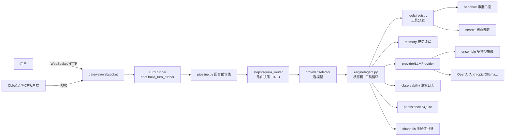

# OpenSquilla-QinLuza-Studio 深度解构 — Stage 1-4 阶段报告

> 工具：deep-code-analyzer v2.0.0（S1→S7 流程）
> 项目：OpenSquilla-QinLuza-Studio（分支 feat/openai-bridge）
> 日期：2026-08-11
> 状态：**已到达【人工介入点】**（S4 完成，等待用户指定 S5 深挖目标 / S6 功能复现目标 / 跳过）

---

## Stage 1 — 项目全景卡片

| 字段 | 值 |
|---|---|
| 项目名称 | OpenSquilla（Token-Efficient AI Agent） |
| 版本 | 0.5.2（stable） |
| 项目类型 | 全栈应用（微内核 AI Agent 运行时 + Vue WebUI + Electron Desktop + CLI + 多聊天通道） |
| 语言 | Python 3.12+（核心），TypeScript/Vue 3（WebUI，536 TS + 139 Vue 文件），Electron（desktop/） |
| 构建 | Hatchling（wheel/sdist）+ uv（依赖管理，uv.lock 775KB）+ pnpm（WebUI workspace） |
| 部署 | Docker（Dockerfile + compose.yaml）、Desktop 安装器（macOS dmg / Windows exe）、uv tool install、install.ps1 / install.sh |
| 数据库 | SQLite（aiosqlite + sqlmodel + sqlalchemy + sqlite-vec 向量扩展） |
| 入口点 | CLI：`opensquilla.cli.main:app`（typer）；Gateway：`opensquilla.cli.main:gateway_app`；OpenAI Bridge：`python -m opensquilla.openai_bridge.server` |

**技术栈要点（S1 对照维度 #7/#9/#10/#11）**：
- 依赖管理 #9：uv + pyproject.toml 全量声明，extras 分层（dev/mcp/msg/memory/recommended/matrix/document-extras/swebench）
- 部署运维 #10：Docker + compose.yaml + CI（.github/workflows）+ service-units/（systemd 单元）
- 配置管理 #11：`opensquilla.toml`（TOML）+ 环境变量，优先级 env > toml > defaults；敏感键支持 `*_env` 间接引用（如 `search_api_key_env`）
- 国际化 #7：README 8 语言（en/zh-Hans/ja/fr/de/es + de/es 变体），WebUI 内置多语言

**设计原则提取**（`reflected_in_code` 基于源码验证）：

1. **Token 效率优先**（"Same budget, more capability, better results"）— README 明示，源码中有 `token_estimation.py`、`result_budget.py`、`context_budget.py`、`tool_result_store.py` 等一整套预算机制。`reflected_in_code: true`
2. **微内核架构**（microkernel AI agent，单一共享 turn loop）— 所有入口（CLI/WebUI/通道）跑同一 `engine/agent.py` 状态机。`reflected_in_code: true`
3. **本地优先的路由**（SquillaRouter on-device router，按轮次选 cheapest capable model）— `squilla_router/` + `engine/routing/`。`reflected_in_code: true`
4. **可插拔 Provider 层**（同一 schema 接入 20+ LLM 提供商）— `provider/` 统一 `LLMProvider` 协议。`reflected_in_code: true`
5. **有界执行**（技能层显式状态机、重试上限、轮次上限）— 项目自身技能系统也贯彻该理念。`reflected_in_code: true`

**异常信号（anomaly_signals）——高价值深挖候选**：

| # | 信号类型 | 路径 | 数值 | 分析价值 |
|---|---|---|---|---|
| A1 | 巨型单文件 | `engine/agent.py` | 935,229 B（≈2万行） | 号称"Core loop under 500 lines"却 935KB，注释与实现严重背离，是拆分/理解最大难点 |
| A2 | 巨型单文件 | `engine/runtime.py` | 459,842 B | 运行时代码膨胀 |
| A3 | 巨型单文件 | `gateway/rpc_sessions.py` | 344,919 B | RPC 会话层单体 |
| A4 | 巨型单文件 | `gateway/boot.py` | 200,795 B | 启动装配单体 |
| A5 | 巨型单文件 | `gateway/channel_dispatch.py` | 168,579 B | 通道分发单体 |
| A6 | 巨型单文件 | `gateway/config.py` | 152,813 B | 配置模块单体 |
| A7 | 深度嵌套 | `src/opensquilla/skills/bundled/` | 技能包嵌套 ≥5 级 | 技能生态复杂 |
| A8 | 大型模块 | `gateway/` | ~100 文件 | 单模块文件数超 50 |

**S1 假设记录**：`artifacts.py`(91KB)、`finalize_evidence_gate.py`(59KB)、`meta_resolution.py`(62KB) 亦为高规模文件，未逐一验证归属。

---

## Stage 2 — 模块映射（覆盖率评估）

`src/opensquilla/` 一级子目录 36 个（含 4 个非源码目录），业务模块 33 个：

| 模块 | 一句话职责 | 置信度 |
|---|---|---|
| `engine/` | Agent 核心状态机 + 工具循环 + 回合管线（agent.py / runtime.py / pipeline.py） | confirmed |
| `gateway/` | ASGI 网关（FastAPI + WebSocket + RPC 调度 + 100 个 rpc_* 处理器） | confirmed |
| `provider/` | 统一 LLM Provider 抽象层（OpenAI/Anthropic/Ollama/Ensemble/失败分类） | confirmed |
| `squilla_router/` | 本地模型路由运行时（controller + v4_phase3 + self_learning/ + models/） | confirmed |
| `tools/` | 工具注册表 + 内置工具（registry.py + builtin/） | confirmed |
| `sandbox/` | 沙箱与安全分级（Bubblewrap/Seatbelt/Noop + 审批门控 governance） | confirmed |
| `safety/` | 安全基线（注入防护/工具分级/权限矩阵/沙箱执行） | confirmed |
| `memory/` | 长期记忆（后端/嵌入/检索/同步/刷新计划） | confirmed |
| `session/` | 会话生命周期 + 压缩（compaction）+ key 构建 | confirmed |
| `scheduler/` | Cron 作业引擎（解析/抖动/执行/回收） | confirmed |
| `channels/` | 通道适配层（Terminal/WebSocket/Slack/Feishu/Discord/Telegram） | confirmed |
| `search/` | 网页搜索抽象（DDG/Bocha/Brave/IQS/Tavily/Exa） | confirmed |
| `mcp/` | 出站 MCP 客户端（连接外部 MCP 服务器导入工具） | confirmed |
| `mcp_server/` | 入站 MCP 服务器桥（向外部 MCP 客户端暴露会话） | confirmed |
| `openai_bridge/` | OpenAI 兼容 HTTP 桥（/v1/chat/completions，供 CodeBuddy 等接入） | confirmed |
| `cli/` | Typer CLI（含 TUI/opentui） | confirmed |
| `contracts/` | 运行时边界共享稳定契约 | high |
| `identity/` | Agent 人设解析（AGENTS.md/SOUL.md）+ 系统提示组装 | confirmed |
| `onboarding/` | 引导配置核心（provider/channel/audio 规格目录） | confirmed |
| `persistence/` | 持久化层（yoyo 迁移 + 原语） | confirmed |
| `migration/` | 外部 Agent 运行时导入迁移助手 | high |
| `observability/` | 可观测性（决策日志/安全事件/原始调用审计/追踪/回放） | confirmed |
| `health/` | 就绪与恢复诊断（HealthFinding/FixStep） | confirmed |
| `recovery/` | Desktop RC4 恢复契约（标准库-only 导入） | confirmed |
| `uninstall/` | 清单驱动卸载器（inventory→plan→actions 三段式） | confirmed |
| `agents/` | 具名 Agent 配置 | medium |
| `application/` | 应用自有领域服务 | medium |
| `plugins/` | 内置插件 | medium |
| `eval/` | 纯观测基准（ensemble_benchmark） | confirmed |
| `compat/` | 兼容助手（aiosqlite 封装） | confirmed |
| `skills/` | 技能系统（六层架构：Extra→Bundled→Managed→Personal→Project→Workspace） | confirmed |
| `chat/` | 前端中立对话契约 | medium |
| `contrib/` | 保留命名空间（显式空，禁止使用） | confirmed |

非源码目录：`__pycache__/`、`dist/`（构建产物）。覆盖率 33/36 ≈ **91.7% ≥ 80% 闸门通过**。

---

## Stage 3 — 数据流追踪

### 主链路（Gateway → Engine → Provider）假设-验证

**S3-H1：WebSocket 消息 → 网关分发 → TurnRunner → Agent 状态机**
- 证据：`gateway/websocket.py`(51KB) + `gateway/boot.py` 的 `build_turn_runner_from_services` + `engine/agent.py` 显式状态机
- 置信度：high（同一函数链直接可见）

**S3-H2：回合前管线 pipeline.py 按序转换 TurnContext**
- 证据：`engine/pipeline.py` `run_pipeline(ctx, steps)`，steps 包含 `engine/steps/`（resolve_model / squilla_router / skills_filter / meta_resolution / coding_mode）
- 置信度：confirmed

**S3-H3：路由决策在回合前完成（router → tier → provider/model）**
- 证据：`engine/steps/squilla_router.py`(61KB) + `squilla_router/controller.py` 输出 T0-T3/P0-P2 + `provider/selector.py` + `gateway/routing.py`(26KB)
- 置信度：high

**S3-H4：持久化走 SQLite（sqlmodel + yoyo 迁移）**
- 证据：`persistence/migrator.py` + `compat/aiosqlite.py` + migrations/ 33 个迁移文件
- 置信度：high

**S3-H5：记忆写路径 memory/manager.py + flush 计划 + 关键词/语义双检索**
- 证据：`memory/` 包 __init__ 导出 MemoryManager / MemoryFlushPlan / MemoryRetriever
- 置信度：high

### 数据流图（Mermaid）

**S3 假设表**：5 条假设全部闭合（3 confirmed / 2 high），无未验证路径。

---

## Stage 4 — 设计模式与架构原则提取（含证据 + 置信度）

### 设计模式（design_patterns）

**P1. 微内核 + 插件式子系统** — 核心 turn loop 单一（engine/agent.py），周边全部子系统（provider/sandbox/memory/search/channels/skills）以可插拔方式挂载。
- 证据：`engine/__init__.py` 显式说明"public surface is lazy"；`tools/__init__.py` 副作用注册
- 置信度：confirmed

**P2. 统一 Provider 协议 + 工厂族** — 所有 LLM 后端实现同一 `LLMProvider` 协议，`provider/` 下 anthropic/openai/ollama/ensemble 平铺；`resolve_failover_chain` 提供故障转移链。
- 证据：`provider/__init__.py` 导出 `LLMProvider` + `resolve_failover_chain`；`provider/protocol.py`
- 置信度：confirmed

**P3. 多模型集成（Ensemble）** — `provider/ensemble.py`（G8 B5 风格），多模型并行/投票，配合 CredentialPool 轮换。
- 证据：`provider/ensemble.py` 模块 docstring "G8 B5-style multi-model ensemble provider"
- 置信度：confirmed

**P4. 本地路由分级（Tier 化）** — SquillaRouter 按难度输出 T0-T3 / P0-P2，`router_tiers.py` + `engine/routing/policy.py`(42KB) 决定模型档位，简单任务避免高端模型成本。
- 证据：`squilla_router/controller.py` TIER_ORDER + DIFFICULTY_WEIGHTS；README "cheapest model that can handle it"
- 置信度：confirmed

**P5. 预算治理（Budget Governor）** — 三层预算：ContextBudget（`context_budget.py` 10KB）、ResultBudget（`result_budget.py` 34KB）、工具结果压缩（`tool_result_store.py` 18KB）。
- 证据：`result_budget.py` ToolResultBudgetClass 枚举（EXTERNAL/LOCAL/ARTIFACT/ERROR/CONTROL/UNKNOWN）
- 置信度：confirmed

**P6. 沙箱 + 审批门控（Approval Gate）** — `sandbox/governance.py` 的 ApprovalGate/DenialLedger/action_fingerprint，执行前门控、执行后守卫。
- 证据：`sandbox/__init__.py` 导出 gate_execution / post_denial_guard
- 置信度：confirmed

**P7. 六层技能优先级栈** — skills 六层架构（低→高：Extra/Bundled/Managed/Personal/Project/Workspace），同名技能高层覆盖低层。
- 证据：`skills/__init__.py` 模块 docstring
- 置信度：confirmed

**P8. 清单驱动卸载（Inventory→Plan→Actions）** — uninstall 三段式纯函数设计，`--dry-run`/`--json` 渲染计划不执行 I/O。
- 证据：`uninstall/__init__.py` docstring
- 置信度：confirmed

**P9. 标准库-only 恢复契约** — `recovery/` 保持导入时零第三方依赖，供 Desktop 在加载完整运行时前检查配置。
- 证据：`recovery/__init__.py` docstring "stays standard-library-only at import time"
- 置信度：confirmed

### 架构原则（architecture_principles）

**A1. 正交解耦（Meta/Atom 分离）** — 技能系统自身就是该原则的实例（SKILL.md 元层 vs 原子层）；源码中 `engine/` 与 `gateway/` 通过 contracts/ 通信。
- 证据：`contracts/__init__.py` "Stable contracts shared by runtime boundaries"
- 置信度：high

**A2. 显式状态机替代隐式流转** — engine 用 AgentState/StateChangeEvent 显式建模；Scheduler 用 JobStatus/JobReservation 状态机。
- 证据：`engine/types.py` 导出 AgentState/StateChangeEvent；`scheduler/types.py` JobStatus
- 置信度：confirmed

**A3. 有界执行（Bound & Retry）** — 全局重试/轮次上限；http_retry.py(1.8KB)；provider 失败分类 `failures.py`（ProviderFailureKind + ProviderRecoveryAction）。
- 证据：`provider/failures.py` 导出分类与恢复决策
- 置信度：confirmed

**A4. 可观测性优先（Decision Log + Replay）** — 每回合结构化决策日志 + 安全事件 + 回放 API（只读不重执行）。
- 证据：`observability/__init__.py` 完整 docstring
- 置信度：confirmed

**A5. 配置热更新 + 重启语义分离** — config.toml 顶部注释明确哪些配置 RPC 热生效、哪些需 reload、哪些需 restart。
- 证据：`opensquilla.toml.example` 第 8-14 行
- 置信度：confirmed

### 编码约定（coding_conventions）

- **C1. 惰性导入（Lazy import）**：`engine/__init__.py` PEP 562 `__getattr__` 惰性解析，避免拖入重依赖（tools 注册副作用也被隔离）
- **C2. 副作用隔离**：`result_budget.py` 明确"Lives at top level ... without triggering tool-registry side effect"，且有对应测试 `test_public_tool_surface.py`
- **C3. 超时/预算常量集中**：heartbeat 间隔、stream idle 超时、browser grace 集中注释于 config 示例
- **C4. 结构化日志**：structlog 全量使用
- **C5. 类型严谨**：mypy 全树检查（platform=linux 对齐 CI），`warn_return_any=true`，第三方缺失类型 ignore_missing_imports 白名单

### 安全设计（security_designs）

- **S1. 注入防护**：`safety/injection_guard.py` 用 `<untrusted source='...'>` 信封包裹不可信内容 + XML 转义 + 工具拒绝溯源
- **S2. 工具分级**：`safety/tool_tiers.py` RiskTier 枚举 + 硬编码 admin-only 高危工具清单
- **S3. 权限矩阵**：`safety/permission_matrix.py` `is_tool_allowed(tool_name, channel_kind, principal)` + 通道级覆盖
- **S4. 资源受限沙箱**：`safety/sandbox.py` CPU/内存/墙钟/网络限制
- **S5. 密钥脱敏**：`redaction.py` + `config_secrets.py` + `token_store.py`；错误上游脱敏 `error_redaction.py`
- **S6. 审计链**：safety-YYYYMMDD.jsonl 独立事件流

**S4 汇总**：9 设计模式 + 5 架构原则 + 5 编码约定 + 6 安全设计 = **25 项**（≥3 闸门通过）

---

## 已识别的高价值深挖候选（供 S5 选择）

1. **SquillaRouter 路由算法**（本地模型路由：特征→Tier 决策→自学习闭环，arXiv:2607.11399）
2. **Engine 回合状态机**（agent.py 的显式状态机 + 工具循环 + 证据门控 finalize_evidence_gate）
3. **Tool Result 压缩与预算治理**（result_budget + tool_result_store + context_budget 三层协同）
4. **Provider 故障转移与 Ensemble 集成**（failures.py 分类 + resolve_failover_chain + ensemble）
5. **Memory 系统**（写入刷新计划 + 语义/关键词双检索 + 同步管理器）
6. **Sandbox 审批门控**（ApprovalGate/DenialLedger 指纹化审计）

## 已识别的功能复现候选（供 S6 选择）

1. **自动模型降级/路由**（回合前按难度选模型）
2. **OpenAI 兼容桥**（openai_bridge 暴露 gateway 能力）
3. **工具结果压缩**（大输出→紧凑预览进模型上下文）
4. **注入防护信封**（untrusted 内容包裹机制）
5. **清单驱动卸载**（dry-run 计划渲染）

---

## ⏸ 人工介入点（必须等待用户决策）

**问题 1**：是否需要指定某个子系统/算法/机制进行 **S5 目标深挖**？（候选见上表）
**问题 2**：是否有想复现的具体功能，进入 **S6 功能复现研究**？（候选见上表）
**问题 3**：以上都跳过 → 直接进入 **S7 报告组装**？
