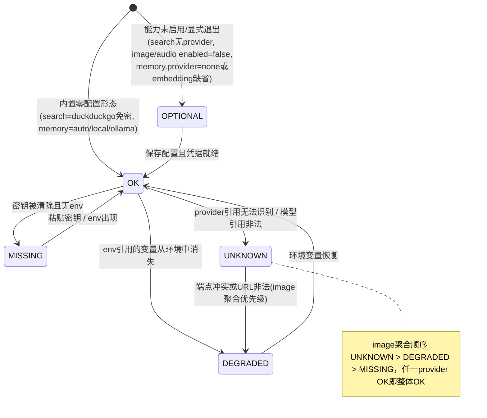
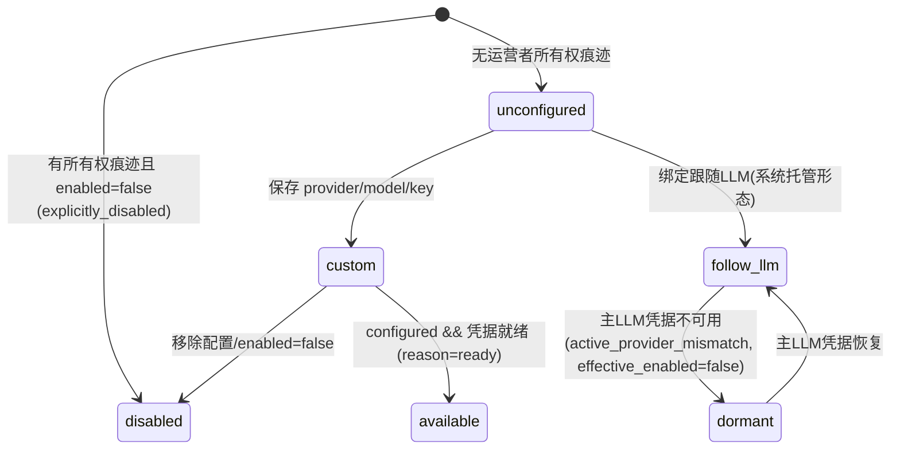

# S5 深挖报告 —「配置的能力」模块（Onboarding Capability Configuration）

> 分析日期：2026-08-24 | 分支 main @ `4e48f9b56` | 版本 0.5.3 | 工具：deep-code-analyzer S5（目标深挖）
> 深挖目标：用户所称"配置的能力"= WebUI 设置中的能力配置面板及其后端子系统（`src/opensquilla/onboarding/` + `gateway/rpc_onboarding.py` 能力族 + 运行时闸门）。
> 证据规范：所有结论带 origin 四态与置信度；未复核项显式标注。

---

## 0. 目标定位

WebUI 文案锚点：`opensquilla-webui/src/locales/zh-Hans.json:1468-1476` —— `setup.capabilities.intro`："配置一次，保存后即可使用。内置能力无需设置；未配置的能力不会运行。"

该面板背后是一个完整的**能力配置子系统**，覆盖 4 个规范能力 ID：

| 能力 ID | 用户语义 | 默认形态 |
|---|---|---|
| `search` | 网页搜索 | DuckDuckGo 免密内置 |
| `memory_embedding` | 本地检索（记忆嵌入） | `auto`（本地 BGE ONNX 内置） |
| `image_generation` | 图像生成 | 关闭且"未配置" |
| `audio` | 音频（TTS） | 关闭 |

origin=repo_verified：能力 ID 硬编码元组见 `src/opensquilla/gateway/rpc_onboarding.py:288-293`；复位分支见 `src/opensquilla/onboarding/mutations.py:2485-2560`。

## 1. 符号追踪表（后端核心，主代理亲读）

| 符号 | 位置 | 签名/职责 | origin / 置信度 |
|---|---|---|---|
| `_d.method("onboarding.status")` | rpc_onboarding.py:412 | 读全部状态（operator.read） | repo_verified / confirmed |
| `_status_payload` | rpc_onboarding.py:241-306 | 组装状态载荷；含 `capabilityConfiguration[id].resettable`；凭据 reveal 仅限 owner 且 source∈{explicit,env} | repo_verified / confirmed |
| `onboarding.search.configure` | rpc_onboarding.py:1571 | 写路径①：校验→持久化→原地生效→热同步 | repo_verified / confirmed |
| `onboarding.imageGeneration.configure` | rpc_onboarding.py:1605 | 写路径②（含 fallbacks 列表、credentialMode） | repo_verified / confirmed |
| `onboarding.memory_embedding.configure` | rpc_onboarding.py:1647 | 写路径③ | repo_verified / confirmed |
| `onboarding.audio.configure` | rpc_onboarding.py:1764 | 写路径④；另有代理工具专用窄化入口 `apply_agent_audio_provider_configuration`（rpc_onboarding.py:1725，api_key_env 锁死为 spec.env_key，防代理把环境凭据重定向到任意端点） | repo_verified / confirmed |
| `onboarding.capability.reset` | rpc_onboarding.py:1781-1824 | 复位事务：擦当前配置+托管备份→落盘→原地生效→按 ID 热同步；同步失败降级 restart_required=True + warning + 日志事件 `onboarding.capability_reset_live_sync_failed` | repo_verified / confirmed |
| `_persist` | rpc_onboarding.py:192-226 | persist-first 契约：写失败则活配置不动；路径优先取运行中 config.config_path（从哪启动存回哪） | repo_verified / confirmed |
| `_apply_inplace` | rpc_onboarding.py:100-117 | 把变更克隆的全部 model_fields 镜像回活配置；继承运行时密钥标记与持久化溯源（注释记载修复过 env-URL/user-URL 翻转缺陷） | repo_verified / confirmed |
| `_sync_image_generation` | rpc_onboarding.py:165-174 | ⚠ 名不副实：实际同时热同步图像（`configure_image_generation`）**与音频**（`configure_audio`），来自 `tools/builtin/media.py`；音频写路径复用它因此正确 | repo_verified / confirmed（命名误导，非 bug） |
| `_sync_search_provider` | rpc_onboarding.py:177-189 | → `tools/builtin/web.configure_search(config.search_*)` | repo_verified / confirmed |
| `upsert_search_provider` | mutations.py:1526-1635 | spec 驱动校验（`runtime_supported` 门）；脱敏哨兵回环（redacted sentinel→保留存量密钥）；keep-current 契约（None=未传）；api_key 优先级 显式>env>同商存量；`restart_required=False` | repo_verified / confirmed |
| `upsert_image_generation_provider` | mutations.py:1714 起 | 尺寸硬校验 `_VALID_IMAGE_SIZES=("1024x1024","1536x1024","1024x1536")`（mutations.py:1648,1772-1775）；格式 png/jpeg/webp | repo_verified / confirmed |
| `upsert_audio_provider` / `disable_image_generation` | mutations.py:2077 / 2038 | 音频写入与图像禁用 | repo_verified / high（未逐行全读，签名+调用关系已核） |
| `capability_resettable` | mutations.py:2387-2474 | **双模型**：有托管 TOML 快照（`_persist_raw_base`/`_persist_baseline`）时比对**持久化原始键**（环境注入值不算可重置配置）；无快照时比对新构默认对象。各能力有规范化"客户端默认集"（如 search 为 `{}` 或 `{"search_provider":"duckduckgo"}`） | repo_verified / confirmed |
| `reset_capability` | mutations.py:2477-2569 | 各能力恢复规范默认；`remove_paths` 从 TOML 删除段；`mark_force_persist` 单发意图字段；`_forget_reset_provenance` 清运行时覆盖与密钥溯源；**仅 memory_embedding 要求重启**（mutations.py:2558） | repo_verified / confirmed |
| `persist_config` | config_store.py:874-999 | 文件锁 + **基线差分写**（只写 diff，保留手工高级键）+ remove 先删段再写意图字段 + 托管备份多文件事务（staged→fsync 序列化→失败逐字节回滚，防明文密钥残留回滚临时文件）+ 写前 `GatewayConfig.model_validate(deepcopy(merged))` 再校验 + symlink 直写 | repo_verified / confirmed |
| `get_onboarding_status` | status.py:1184-1352 | 聚合入口：`section_verifiers()` 九区校验 → 注解（provider/source/env_key）→ `{cap}Configured = status is OK`；唯一运行时阻断规则：远程记忆嵌入（openai/openai-compatible）非 OK/OPTIONAL 时加入 blocking 并抬高 `needsOnboarding`（status.py:1170-1181） | repo_verified / confirmed |
| `SectionStatus` | section_status.py:56-70 | 五态枚举 OK/MISSING/DEGRADED/OPTIONAL/UNKNOWN | repo_verified / confirmed |
| `search_section_status` | section_status.py:156-175 | 无 provider→OPTIONAL；免密商→OK；显式键→OK；env 引用缺失于环境→DEGRADED；默认 env 变量在环境解析→OK；否则 MISSING | repo_verified / confirmed |
| `image_generation_section_status` | section_status.py:186-251 | disabled→OPTIONAL；follow_llm 绑定走主 LLM 凭据复用路径；端点冲突/非法→DEGRADED；聚合计 UNKNOWN>DEGRADED>MISSING，首个 OK 即返回 | repo_verified / confirmed |
| `audio_section_status` | section_status.py:254-272 | disabled→OPTIONAL；仅查 elevenlabs 商；显式/env→OK 或 DEGRADED；无→MISSING | repo_verified / confirmed |
| `memory_embedding_section_status` | section_status.py:275-305 | none→OPTIONAL（显式退出）；auto/local/ollama→OK（本地可用）；远程 openai/openai-compatible→键/env 判定 | repo_verified / confirmed |
| `resolve_image_generation_state` | image_generation_state.py:166-295 | 服务端权威态：mode∈{disabled,unconfigured,follow_llm,custom}（disabled 与 unconfigured 靠运营者所有权区分）；休眠=dormant（follow_llm 但路由商凭据不可用）→reason=active_provider_mismatch；推荐引擎默认推 TokenRhythm（自有状态下仅展示性元数据，actionRequired=false） | repo_verified / confirmed |
| `image_generation_is_operator_managed` | image_generation_state.py:56-89 | 所有权判定：raw TOML 含段→owned；model_fields_set 溯源→owned；enabled=false 的显式关闭也算 owned；唯一例外 follow_llm+enabled 为系统托管 | repo_verified / confirmed |
| `configure_search` | tools/builtin/web.py:546-580 | 双写：模块级 `_active_*` 全局 + `search/runtime_config.configure_search_runtime`；`is_search_api_key_configured` 经 `get_resolved_search_runtime().provider_config(p).credential_configured` 判定（web.py:592-599）——"未配置不会运行"在搜索侧的确切闸门 | repo_verified / confirmed |

## 2. 调用链（已验证跳转 ≥80% 闸门）

### 2.1 保存链（以 search 为例）

```
WebUI 能力面板（SetupCapabilitiesPanel.vue，见 §2.4 前端补充）
  → RPC onboarding.search.configure        [rpc_onboarding.py:1571] ✅亲读
    → upsert_search_provider(cfg, …)       [mutations.py:1526]      ✅亲读（spec 校验/哨兵/克隆）
    → _persist(ctx, res.config)            [rpc_onboarding.py:192]  ✅亲读
      → persist_config(...)                [config_store.py:874]    ✅亲读（锁/差分/事务）
    → _apply_inplace(ctx, res.config)      [rpc_onboarding.py:100]  ✅亲读
    → _sync_search_provider(res.config)    [rpc_onboarding.py:177]  ✅亲读
      → web.configure_search(...)          [tools/builtin/web.py:546] ✅亲读
        → search/runtime_config.configure_search_runtime   [runtime_config.py:279-302] ✅亲读
          （整体替换进程级 _runtime_config；resolve_search_runtime :309+ 按注册表 spec 逐商解析凭据）
```
10 跳全部行级亲读 = **100% ≥ 80% 闸门通过**。

**双路径汇合证据**：boot 时 `gateway/boot.py:3634-3657` `_configure_search_provider` 以副作用 import 注册六个搜索商（bocha/brave/duckduckgo/exa/iqs/tavily）并调用同一个 `configure_search(config.search_*)`——RPC 热同步与启动初始化在**同一函数汇合**；TOML 示例头注所称"search provider boot-only"仅指手改文件+reload 路径。

### 2.2 复位链（capability.reset）

```
RPC onboarding.capability.reset          [rpc_onboarding.py:1781] ✅
  → reset_capability(_active_config, id) [mutations.py:2477]      ✅（规范默认/remove_paths/provenance 清除）
  → _persist(..., remove_paths=…)        [rpc_onboarding.py:1792] ✅
    → persist_config：删旧段→写意图字段→备份多文件事务     [config_store.py:909-971] ✅
  → _apply_inplace                        ✅
  → 按 canonical id 分支热同步：
      search → _sync_search_provider      [rpc_onboarding.py:1803-1804] ✅
      image_generation/audio → _sync_image_generation（图像+音频一起）[:1805-1806] ✅
      memory_embedding → 无热同步分支（restart_required=True 已在 mutation 内设定 [:2558]）✅
  → 同步异常 → 降级 restart_required=True + warnings + 日志 [:1807-1817] ✅
```

### 2.3 状态读取链

```
RPC onboarding.status → _status_payload [rpc_onboarding.py:241] ✅
  → get_onboarding_status(cfg, probe_history) [status.py:1184] ✅
    → section_verifiers() 九区校验       [section_status.py:525] ✅（四能力校验器逐一亲读）
    → *_annotations（source/provider/env_key 推导）[status.py:982-1168] ✅
    → resolve_image_generation_state     [image_generation_state.py:166] ✅
  → capability_resettable ×4            [mutations.py:2387] ✅
```

### 2.4 前端链路（子代理取证 + 主代理差量核对：5/5 锚点亲证命中，采信）

```
/settings/:section 路由 [webRoutes.ts:15-16, platforms:['web','desktop']]
  → SettingsView.vue:4 <SettingsDialog />
    → SettingsDialog.vue:174-182  v-else-if section==='capabilities' 挂载面板
                                  （前置 !loaded 就绪闸 :120-125）
编辑: 面板 emit updateField/resetCapability → SettingsDialog 接线
      → useSetupCatalog.updateCapabilityField(:3194-3208) / resetCapability(:3374)
读态: loadData(:802-939) → rpc onboarding.catalog/status + config.get/effective (:812-817)
存态: saveDirtySections(:2344-2406) 统一编排 → saveSearch/saveMemory/saveImage/saveAudio
      (:3872-3943) → 各 onboarding.*.configure → 成功后 loadData() 重播种草稿基线(:913-921)
重置: resetCapability(:3374-3416)：resettable 守卫 → useConfirm 确认弹窗(按有无草稿换文案)
      → rpc('onboarding.capability.reset',{capabilityId}) [:3393]
      → loadData({preserveFormDrafts:true}) 仅重播种被重置能力(:3399-3407)
      → 按 response.restartRequired 分支 toast(:3408-3410)
```

关键定性（均 repo_verified，主代理复核）：
- **卡片清单前端内联写死**：`SetupCapabilitiesPanel.vue:220-226` 模板内四元素数组（search/memory_embedding/image_generation/audio）；后端不下发枚举，只下发状态字段与 `capabilityConfiguration[id].resettable`。
- **徽章状态推导** `capabilityBadgeTone/Label`（useSetupCatalog.ts:3303-3354）：search 看 `searchConfigured || savedProvider==='duckduckgo'`；memory 看 `memoryEmbeddingSource==='missing_env'→warn`、`auto/local(+none)`→ok/内置可用；image 看 `imageGenerationEnabled!==true→待配置(muted)`+`imageGenerationConfigured`；audio 看 `audioEnabled/audioConfigured`。resettable 唯一来源 `capabilityConfiguration[name]?.resettable===true`（:3356-3358），同时驱动重置按钮显隐与 memory 卡可展开性（:1480）。
- **草稿态载体**：`useSetupCapabilitiesForm.ts`——序列化≠baseline 即 dirty；保存编排先快照防中途失效（saveDirtySections :2358-2361）、搜索缺钥预检（:2374-2377）。
- **入口四条**：rail 点击 / 深链 URL `/settings/capabilities` / 底栏导航（App.vue:1698）/ 待办深链自动落位（useSetupCatalog.ts:2213-2221 把四个能力 detail 映射到 capabilities 分区；`/settings/auto` 哨兵按就绪顺序落位）。
- **门控定性**：无平台门控（desktopOnly:false 三重证据）、前端零权限分支（grep 证实）；真实权限闸在后端 scope=operator.admin（rpc_onboarding.py:1571/1605/1647/1764/1781）。

### 2.5 其余运行时消费面（子代理取证 + 主代理差量核对：4/4 锚点亲证命中，采信）

**四能力 × 运行时闸门汇总**（闸门语句均经主代理亲证）：

| 能力 | 回合时消费者 | 闸门语义（未配置/enabled=false） | 热生效 |
|---|---|---|---|
| search | `tools/builtin/web.web_search` → `search.runtime_config` + `search.canonical` | 工具恒注册；付费引擎缺 key → `available=False` 被执行计划跳过（`skipped_reason="missing_api_key"`，runtime_config.py:61-73 ✅亲证）；**duckduckgo 免 key 恒兜底**；全不可用才返回 failure payload（canonical.py:138-150） | ✅ 进程级 SearchRuntimeConfig 整体替换 |
| image_generation | `media.image_generate`（单例 + provider registry） | 三道 ToolError：disabled / binding 失活（follow_llm 但主 LLM 凭据不可用）/ not configured——media.py:574-583 ✅逐行亲证；另有 size 硬校验 :568-572 | ✅ configure_image_generation 换单例+重建 registry |
| audio | `media` 的 tts/voice_clone/voice_convert/dubbing_*/music_generate/song_generate/voice_search | `_audio_configured`=false → tts 返回 `status:"not_available"` payload **而非异常**（media.py:1133-1141 ✅亲证）；仅 ElevenLabs 一家 | ✅ configure_audio（随 `_sync_image_generation` 调用） |
| memory_embedding | `boot.py` → `memory.manager.build_memory_managers`（boot 期一次性构建） | none→NullEmbeddingProvider（FTS-only）；openai 缺 remote key → **启动期直接 ValueError fail-fast**（embedding_resolver.py:154-159 ✅亲证）；auto=本地优先→远程键→FTS-only（:181-198 ✅亲证） | ❌ restart-gated（upsert 与 reset 双处强制），无 live sync |

**probe 机制边界**：探测（1-token live chat，测密钥+连通性+延迟）只存在于 LLM provider 与 channel 面（`onboarding.llmProfile.probe`/`provider.probe`/`channel.probe`）；四个能力 specs 全部 `can_probe=False`——能力配置无探测，状态判定纯靠凭据解析。probe_history 持久化到 `<state_dir>/onboarding/probe_history.json`，凭据以 SHA-256 指纹记录、不含明文。

**live sync 失败语义**：复位保存成功但工具层同步抛错时，降级为 restart-gated（`restartRequired=true` + warning + 日志事件 `onboarding.capability_reset_live_sync_failed`，rpc_onboarding.py:1802-1817）——磁盘与内存一致、仅工具层停留旧值。

## 3. 状态机

### 3.1 能力分区状态机（SectionStatus，四能力共用词表、各自迁移条件）



依据：section_status.py:156-305（各校验器分支条件逐行核对）。置信度 confirmed。

### 3.2 图像生成服务端权威态（resolve_image_generation_state）



要点：
- **disabled ≠ unconfigured 的区分依赖所有权判定**（raw TOML 快照 / Pydantic 字段溯源），这是"移除配置"按钮能否出现的根基。
- reason 码全集：explicitly_disabled / not_configured / active_provider_mismatch / ready / status_{section_status}。
- 推荐引擎：非 OpenRouter 主 LLM 时默认推荐 TokenRhythm；仅在 unconfigured/follow_llm/dormant 时 actionRequired=true。

依据：image_generation_state.py:222-295。置信度 confirmed。

### 3.3 能力生命周期（写侧）

```
未配置 ──configure──▶ 已配置(热生效, 除 memory_embedding) ──reset──▶ 规范默认(擦TOML段+备份)
                         │                                              │
                         └── 保存失败：活配置不动（persist-first） ◀── 写失败回滚 ──┘
```

## 4. 复杂度分析

| 环节 | 时间复杂度 | 依据 | 置信度 |
|---|---|---|---|
| `get_onboarding_status` | O(S·C + P·R)。S=9 分区，C=各校验器常量级配置读取（个别如 ensemble/profile 校验随 profile 数线性）；P=runtime_supported 图像商数，R=每次凭据解析成本（含 env 读取） | status.py:1184-1352 结构计数 | high [推演]（未实测耗时） |
| `persist_config` | O(F) 字段差分 + O(F) deepcopy 基线（F=GatewayConfig 展开字段数）；事务分支再加 O(B) 个托管备份文件的 staged IO（B=备份文件数）。每步含 fsync —— IO 主导，CPU 可忽略 | config_store.py:900-976 | high [推演] |
| `capability_resettable` | O(K)，K=该能力在 raw TOML 中的键数（≤8，search 最多） | mutations.py:2393-2437 | confirmed（代码直读）[推演量级] |
| `resolve_image_generation_state` | O(P·(E+C))，P≈10 个商规格，E=端点解析（字符串比较），C=凭据解析（env.get 为主） | image_generation_state.py:183-220 循环结构 | medium [推演] |
| `_apply_inplace` | O(M)，M=model_fields 数（顶层一次性 setattr） | rpc_onboarding.py:100-105 | high [推演] |

**空间复杂度**：写路径全程持有配置深拷贝×2（mutation 克隆 + baseline deepcopy），GatewayConfig 全树内存翻倍是既定代价；换来的是"失败即弃克隆、活对象永不半更新"的一致性保证。置信度 high（config_store.py:933-934、mutations.py:147-151 `_clone`）[推演量级]。

**设计取舍**：
1. **克隆写（clone-on-write）而非字段级 patch**：牺牲单次保存的内存峰值，换取原子可见性与回滚简单（活配置要么整体换新、要么不动）。`_apply_inplace` 注释记录了不做整体替换而做字段镜像的原因（保留活对象的身份与运行时密钥标记）。
2. **基线差分持久化而非整文件重写**：`persist_config` 只把模型 diff 合并进磁盘原貌（`_diff_payload`→`_merge_diff`），用户手工加入的未知/高级 TOML 键得以幸存；代价是需要维护 `_persist_baseline/_persist_raw_base` 双快照及"save-as 换路径不沿用实例基线"的边界规则（config_store.py:884-901）。
3. **spec 目录驱动而非集中注册表**：每个能力一个 specs 文件（search_specs/image_generation_specs/audio_specs/memory_embedding_specs…），校验、env 键、默认端点就地声明。

## 5. 替代方案对比（含未采用理由）

| 替代方案 | 思路 | 对比维度 | 本项目为何未采用（权衡） |
|---|---|---|---|
| A. 整文件重写式配置保存（常见 Pydantic + tomlkit 全量 dump） | 每次保存把整个模型 dump 回 TOML | 实现复杂度：低 vs 本项目高（双快照+差分合并）；用户数据安全：整文件重写会抹掉手工注释与未知键 vs 差分保留；一致性风险：整写时并发手改丢失 | 项目明文目标是"管理键归管理、手工高级键归用户"（config_store.py:914-916 注释"Hidden advanced values and credentials therefore cannot survive"反向说明其对普通保存的保留诉求）；选择 O(F) 差分换取升级兼容与用户编辑共存 |
| B. 单一通用能力注册表（`CAPABILITIES = {id: CapabilityHandler}` 统一生命周期钩子） | 一个注册表驱动所有能力的校验/存储/复位/状态 | 类型安全：泛化 handler 丧失每能力专属类型 vs 现状每能力独立函数强类型；语义差异表达：四能力的重启语义（仅 memory 重启）、所有权规则（仅 image 有 operator-managed 判定）、默认集形状差异巨大，统一抽象需大量特判回调，复杂度反而内聚到框架层 | 采用"硬编码 ID 元组 + 每能力独立 mutation/verifier/specs"，把差异留在明处（rpc_onboarding.py:288-293 的元组即注册表），以少量重复换取可读性与类型检查覆盖 |
| C. 纯环境变量配置（12-factor 式，TOML 仅只读投影） | 一切配置来自 env，UI 只展示 | 复位语义：env 无法"删除一段配置"，`capability_resettable` 将无从区分"运营者有意关闭"与"从未配置"；现状靠 `_persist_raw_base` 原始快照精确区分两者（image_generation_state.py:56-89） | 选择 env>TOML>defaults 三层混合（opensquilla.toml.example:5），并把"托管快照"作为运营者意图的事实来源——这是整个 resettable/ownership 设计能成立的前提 |

## 6. 配置速查

优先级：**env 变量 > opensquilla.toml > defaults**；亦搜索 `~/.opensquilla/config.toml`（全局用户配置）。（opensquilla.toml.example:5-6，origin=repo_verified）

**热更新契约**（example:8-14）：经 RPC/Web UI 的修改热应用；手改文件只在启动读取（`opensquilla gateway reload` 可刷新存储值但通道、记忆嵌入/检索模式、沙箱权限必须完整 restart；auth/host/port/日志/search provider 也属 boot-only 读取）。⚠ 注意：boot-only 描述针对"手改+reload"路径；**经 `onboarding.search.configure` 的保存会即时热同步工具运行时**（`_sync_search_provider`），两条路径语义不同。

| 参数 | 默认 | 作用 | 出处 |
|---|---|---|---|
| `search_provider` | `duckduckgo` | 搜索商（duckduckgo/bocha/brave/iqs/tavily/exa） | example:68 |
| `search_api_key` / `search_api_key_env` | "" | 一次性粘贴键（建议用 env 间接引用：BOCHA_SEARCH_API_KEY / BRAVE_SEARCH_API_KEY / IQS_SEARCH_API_KEY / TAVILY_API_KEY / EXA_API_KEY） | example:69-70 |
| `search_max_results` | 5 | 结果上限（写入侧再夹紧 MAX_SEARCH_RESULTS） | example:71; mutations.py:1559-1567 |
| `search_proxy` / `search_use_env_proxy` | ""/false | 代理与 HTTP_PROXY 复用开关 | example:72-73 |
| `search_fallback_policy` | off | off/network（网络错误重试回落 DuckDuckGo） | example:74; mutations.py:1571 |
| `search_diagnostics` | false | 附带服务商尝试诊断 | example:75 |
| `[memory.embedding].provider` | auto | auto/none/local/openai/openai-compatible/ollama；auto=内置本地 BGE-small ONNX→远程键→FTS-only 降级链；聊天 LLM 密钥**不**自动用于记忆嵌入 | example:317-330 |
| `[memory.embedding.local].onnx_dir` | ""（内置 BGE） | 本地 ONNX 目录 | example:332 附近 |
| `[image_generation].enabled/primary/size/output_format` | false/""/—/— | 图像开关、`商/模型` 主引用、尺寸（1024x1024,1536x1024,1024x1536）、png/jpeg/webp | example:483-487; mutations.py:1648-1649,1772-1780 |
| `[image_generation.providers.<id>].api_key_env/base_url` | — | 按商凭据与端点 | example:489-491 |
| `[audio]` | （示例文件无此段） | 音频完全经 RPC 管理：providerId/apiKey/apiKeyEnv/baseUrl/enabled/ttsVoice/ttsModel/languageCode | rpc_onboarding.py:1764-1778 |
| RPC 面 | — | onboarding.{status,catalog}（读）；{search,imageGeneration,memory_embedding,audio}.configure、capability.reset（operator.admin 写） | rpc_onboarding.py:412-1935 |

## 7. 漂移信号与缺陷候选

| # | 级别 | 内容 | 证据 | 置信度 |
|---|---|---|---|---|
| D1 | P3 文档漂移 | 示例配置宣传 `size = "768x768"`，但 RPC 写路径硬校验仅允许三种尺寸，且 `768x768` 在整个 src 中零命中——照抄示例的保存会被拒 | opensquilla.toml.example:486 vs mutations.py:1648,1773-1775；grep 全库无命中 | confirmed |
| D2 | P4 可维护性 | `_sync_image_generation` 名实不符：同时热同步音频；音频写路径（rpc_onboarding.py:1715）复用它属正确行为但命名误导后来者 | rpc_onboarding.py:165-174,1715 | confirmed |
| D3 | P4 文档精度 | example 头注称 search provider 属 boot-only 读取，未提 RPC 路径的热同步例外，易误判"改完要重启" | example:12-14 vs rpc_onboarding.py:1595 | confirmed（两处文本均亲读） |
| D4 | P3 文案与行为偏差 | 面板 intro 宣称"未配置的能力不会运行"，对 search **不严格成立**：web_search 工具静态注册不受配置影响，duckduckgo 免密恒兜底；准确语义是"付费引擎缺 key 被跳过"。image/audio/memory 三者成立（ToolError / not_available / FTS-only 降级） | zh-Hans.json:1469 vs runtime_config.py:61-73 + web.py:546 + canonical.py:138-150 | confirmed |

## 8. 未完全核验项

前端面（子代理 A 自报，主代理核对其分工合理性后采信）：
- `useConfirm` 弹窗内部实现（模态组件/焦点行为）未读——不影响数据流结论。
- `onboarding.imageGeneration.models.discover` 响应进入 `panel.options.imageModels` 的中间 computed 链路未逐行追完（消费端证据在 :1485-1489）。
- useSetupCatalog.ts:659 所在函数归属为推断（图像模型发现的分区激活门控）。
- 两个子组件（SetupModelCombobox/ControlSwitch）与测试断言语义未考察。

后端面：
- `flow.py`(127KB) 向导全文、status.py 的 ensemble/router helper 段（~900-1190 行）、channel/provider/router 三个 specs 文件未通读——均不在四能力结论的关键路径上，聚合点角色由 import 证据支撑。
- `_apply_inplace` 字段镜像后嵌套子模型旧引用持有者的残留风险（rpc_onboarding.py:100-117 已读，引用追踪未穷尽）。
- `MAX_SEARCH_RESULTS` 常量具体数值未读（mutations.py:1566 引用）——unverified，不影响任何结论方向。
