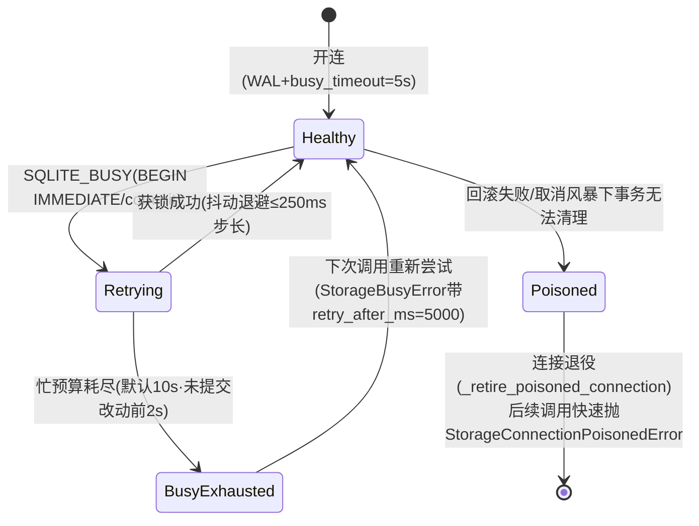

# S5 深挖报告 — 会话存储（session/）与记忆体系（memory/）

> 分析日期：2026-08-24 | 分支 main @ `4e48f9b56`（工作区含未提交改动） | 版本 0.5.3 | 工具：deep-code-analyzer S5 第②轮
> 深挖目标（用户指定）：会话存储体系 + 记忆体系。
> 分工：session/ 由主代理亲读；memory/ 由取证子代理交付 + 主代理差量核对。证据规范同前。

---

## 0. 目标定位

| 子系统 | 目录 | 规模 | 一句话定性 |
|---|---|---|---|
| 会话存储 | `src/opensquilla/session/` | **21 文件，约 1.13MB**；storage.py 独占 **646,349 B / 15,264 行** | 单文件 SQLite 存储巨石：28 张内联表 + 自带并发治理的回合写入引擎 |
| 记忆体系 | `src/opensquilla/memory/` | 见 §2.5（子代理清点） | 长期记忆：嵌入决策链 + 关键词/语义检索 + 刷写计划 |

origin=repo_verified（Get-ChildItem 字节实测 + Get-Content 行数统计）。

## 1. 增量信号：storage.py 是新晋巨型单文件

旧异常信号清单（A1-A8，10-stage1-4-checkpoint.md）**未收录** `session/storage.py`；本次实测它已是全仓第二大 Python 文件：

| 排名 | 文件 | 字节 |
|---|---|---|
| 1 | engine/agent.py | 1,166,429 |
| **2** | **session/storage.py** | **646,349（15,264 行，275 个方法，主类 SessionStorage 自 :1716 起单体 1.35 万行）** |
| 3 | gateway/rpc_sessions.py | 500,775 |

另一条值得记录的演化线：**SQLite 争用治理正在活跃调参**——已提交 6a8007eba 把 busy_timeout 从 100ms 提到 5000ms；工作区还有一处**未提交改动**把交互忙预算从 2.0s 提到 10.0s（storage.py:377-379，git diff 实证）。说明多写入者争用在真实负载下持续暴露。

## 2. 符号追踪表

### 2.1 会话存储核心符号（主代理亲读）

| 符号 | 位置 | 职责 | origin/置信度 |
|---|---|---|---|
| `SessionStorage` | storage.py:1716 起 | 全部 SQLite 操作的唯一入口类（275 方法） | repo_verified/confirmed |
| `_finish_sqlite_call` | storage.py:1971-1991 | **取消屏蔽**：aiosqlite 的 cancel 不会撤销已入队到 worker 的操作，故 shield 到 settle 再向调用方传播 CancelledError——防止"闸门已放、DB 调用仍在飞" | repo_verified/confirmed |
| `_rollback_transaction` | storage.py:1993-2022 | 回滚必须验证 settle；回滚失败 → `_retire_poisoned_connection()` + 抛 `StorageConnectionPoisonedError`（连接永久退役，后续调用快速失败） | repo_verified/confirmed |
| `_begin_immediate` | storage.py:2035-2061 | 写事务一律 `BEGIN IMMEDIATE`；busy 时抖动指数退避重试（25ms 起 ×2^attempt，cap 250ms，deadline=忙预算），耗尽 → `StorageBusyError(retry_after_ms=5000)` | repo_verified/confirmed |
| `_retry_delay` | storage.py:2024-2033 | `random() * min(cap)` 抖动退避 | repo_verified/confirmed |
| 连接开启 | storage.py:1816-1826 | `PRAGMA journal_mode=WAL` 强制 + `busy_timeout=5000`；非 WAL 时转录读走降级 reader（fallback 理由 `journal_mode_not_wal/memory_database/open_failed`，:1858-1874） | repo_verified/confirmed |
| `accept_turn` | storage.py:12115-12209+ | **皇冠写入口**：单事务原子提交"用户消息 + 可选任务 + 请求回执"；幂等（同 scoped client_request_id 返回原回执；同 id 不同 fingerprint 在写入前拒绝）；携带 expected_epoch 乐观并发；互斥规则成文（Goal 回合不得启 Plan run / 不得消费 MetaSkill intent；标注接受需既有会话等） | repo_verified/confirmed |
| `StaleEpochError` | storage.py:126-128 | 会话 epoch 已推进时拒绝旧写者（epoch 列遍布 sessions/transcript/goals/receipts 各表，DDL :599/:649/:690/:743/:799/:1251/:1389） | repo_verified/confirmed |
| 异常族（20+） | storage.py:126-227 | TurnIngressConflict / SessionRoutingConflict / PendingChatInput{Conflict,Capacity,NotFound,Cancelled,AlreadyDispatched} / MetaControlIntentConflict / MetaLaunchDraft{Conflict,Capacity,Unavailable,Discarded} …——把分布式协调语义搬进了单库约束 | repo_verified/confirmed |

### 2.2 表清单（28 张内联 DDL，storage.py:538-1372）

七族：
1. **会话核**：sessions(:538)、project_workspaces(:604)、runtime_preferences(:634)
2. **计划**：plan_revisions(:642)、plan_runs(:686)
3. **目标**：session_goals(:740)、goal_command_receipts(:790)
4. **转录/上下文**：transcript_entries(:818)、compacted_transcript_entries(:853)、session_summaries(:927)、session_context_states(:958)
5. **任务/入队**：agent_tasks(:988)、turn_ingress_receipts(:1019)、pending_chat_inputs(:1045)、pending_chat_input_cancellations(:1077)、pending_chat_input_dispatch_receipts(:1091)
6. **元控制**：meta_control_intents(:1119)、meta_launch_drafts(:1153)、meta_launch_discard_tombstones(:1177)、memory_durable_receipts(:1193 ← 与记忆体系的桥接点)
7. **用量账本**：telemetry_daily_usage(:1230)、usage_events(:1243)、usage_event_items(:1285)、usage_item_billing_receipts(:1310)、usage_billing_receipt_state(:1335)、usage_ledger_state(:1343)、usage_legacy_baselines(:1372)

`transcript_entries` 要点（DDL :818-838）：role/content/tool_calls/**reasoning_content**（schema v3 新增推理回放）/turn_usage/turn_context/token_count + **provenance 五列**（kind/origin_session/source_session_key/source_channel/source_tool——转录溯源）；三索引覆盖 session_id/session_key/(session_id,created_at,id) 游标。

### 2.3 上层组件

| 文件 | 定性（docstring 亲读） |
|---|---|
| manager.py(142KB) | SessionManager —— SessionStorage 之上的高层生命周期操作 |
| compaction.py(94KB) | 上下文窗口压缩——摘要旧消息释放 token 预算 |
| compaction_state.py | OpenSquilla 自有可移植压缩状态；provider 原生压缩块归 provider 上下文状态管 |
| compaction_lifecycle.py | 刷写决策三态：`safe_destructive / degraded_forensic / emergency_ephemeral` |
| goals.py | 持久化 Goals 纯领域契约（0.5.3 新特性）；执行用普通 AgentTask，类型只描述"生成围栏"的持久状态 |

### 2.4 记忆体系符号（子代理取证 + 主代理差量核对：4/4 锚点亲证命中，采信）

memory/ 共 **43 个源文件**。核心符号：

| 符号 | 位置 | 职责 | 置信度 |
|---|---|---|---|
| `LongTermMemoryStore` | store.py（1369 行） | 每 agent 独立 `memory.db` 的建表/索引/混合检索/嵌入缓存；DDL 内联 :55-120（files/chunks/embedding_cache/meta + FTS5 虚表）；vec0 虚表延迟到首次拿到向量维度才建（:513-520） | confirmed |
| `MemoryRetriever.search` | retrieval.py:184-264 | 检索前条件同步 → 双路召回 → 时间衰减（30 天半衰，MEMORY.md 常青豁免）→ min_score 过滤（lexical_guarantee 豁免）→ source 权重（sessions 0.92 折价）→ 可选 MMR 多样性重排 | confirmed |
| `store.search` 融合闸门 | store.py:905-939 ✅亲证 | `use_vector = _vec_available and provider 非 Null`；hybrid=`vw*向量+tw*BM25`（默认 0.7/0.3），向量路异常自动降级 fts_only | confirmed |
| 三条写入口 | — | A 自动回合捕获（turn_finalizer_stage.py:866 → `turns/<slug>/<date>.md`，**刻意不入检索索引**，纯审计）；B 显式 `memory_save` 工具（写文件+即时 index_file，失败快照回滚）；C 刷写提炼写入（复用 B 通道） | confirmed |
| `MemoryFlushPlan` | flush.py:52-60 ✅亲证 | 压缩前抢救计划书：目标路径 + 系统 prompt + soft_threshold_tokens=4000 / force_flush_transcript_bytes=2MB | confirmed |
| `SessionFlushService` | session_flush.py（约 3600 行） | 提炼-落盘-回执执行体；降级链 LLM flush → raw-dump（`memory/.raw_fallbacks/` 点前缀目录，不入索引不参与 TTL）→ error；经只读白名单 handler 强制 append-only | confirmed |
| `Dream` runner | dream/runner.py（430 行）+ 6 子模块 | 记忆整理闭环：mtime 游标扫描→证据累积→确定性排序→LLM PromotionPatch→受限写 MEMORY.md（仅 upsert/merge bullet 到 `## section`）→回执 | confirmed |
| `MemorySyncManager` | sync_manager.py（449 行） | 六类同步触发 + 文件轮询 watcher + TTL sweep；删除失败 re-enqueue 防孤儿 chunk | high |

**权威源与派生关系（本深挖最重要的定性）**：磁盘 Markdown（MEMORY.md/memory/*.md）是**权威源**，SQLite（每 agent 独立 memory.db）是**纯派生可重建索引**——meta 指纹/model 变更即弃库重建（store.py:278-294）。sessions 源是渲染出来的虚拟文档（`sessions/<agent>/<sid>.md`），磁盘不存在。migrations/**不覆盖** memory 表：V004 docstring 明言四表归 memory.db 所有、真实升级发生在 `LongTermMemoryStore.initialize()`（✅亲证）。

## 3. 调用链

```
回合提交（写路径）：
gateway 入队 → accept_turn(entry, expected_epoch, client_request_id, fingerprint,
                task_record?, plan_run?/goal_mutation?/meta_intent_id?…)
  [storage.py:12115] ✅
  → 参数互斥校验（Goal×Plan×MetaSkill×标注）[:12159-12209] ✅
  → BEGIN IMMEDIATE（忙重试：25→250ms 抖动退避，预算内循环）[:2035-2061] ✅
  → 幂等检查：同 scoped client_request_id → 返回原回执；
    同 id 异 fingerprint → 写入前拒绝 [docstring :12150-12157] ✅
  → 多表写入 + commit；失败路径：_rollback_transaction →
    （settle 失败则毒化连接并退役）[:1993-2022] ✅
读取路径：
转录流式读 → 独立 transcript reader 连接（WAL 快照读）
  非 WAL 库 → fallback 只读 reader [:1858-1874] ✅
```

**记忆链（子代理取证，主代理核对锚点后采信）**：

```
捕获A(自动): turn_finalizer_stage.py:866 → TurnCaptureService → turns/<slug>/<date>.md（不入索引）
捕获B/C(工具/刷写): memory_save 工具 / SessionFlushService 提炼
  → 写工作区 MEMORY.md 或 memory/*.md → store.index_file（BEGIN IMMEDIATE；
    嵌入计算/缓存查找刻意在锁外）→ chunks + chunks_fts + (chunks_vec)
检索: memory_search 工具(intent=TOOL) / memory.search RPC(intent=ADMIN)
  → MemoryRetriever.search → sync(检索前保鲜) → store.search 双路融合
  → 无"每轮自动语义注入"；被动注入仅 MEMORY.md 文本（≤4000 字符进系统提示，
    daily notes 默认省略；快照会话首启冻结、memory_save 后刷新）
压缩衔接: should_flush（距压缩阈值≤4000tok 或 transcript≥2MB）
  → SessionFlushService 提炼 → memory_save append → FlushReceipt 回执账本（sessions.db）
  → 失败降级 raw_fallbacks 原子落盘；压缩后 mark_dirty 触发重索引
梦境: cron(memory_dream:<agent>) → 扫描增量→证据→排序→PromotionPatch→受限写 MEMORY.md
```

**并发要点**：memory.db 与 sessions.db 是不同文件——回合转录写、转录读、记忆写天然分库无同库锁竞争；memory 库内 `busy_timeout=5000` 与 WAL 同 session 域对齐；`embedding_cache` 用 INSERT OR IGNORE 保证并发写安全。

**存储 ↔ 记忆桥接（主代理亲证）**：`memory_durable_receipts` 表（storage.py:1193-1227）是记忆持久化的**发件箱回执**——`idempotency_key UNIQUE` + 覆盖指纹三元组（coverage_turn_id/hash/entry_count）+ `status/attempt_count/next_retry_at_ms` 重试字段。写入方：`session/manager.py:2316/2400/2443`（刷写编排时创建）；存储层提供 ON CONFLICT 幂等 upsert（storage.py:9005-9023）与 claim/update 状态流转（:9183-9281）；消费方：boot 时修复扫描（gateway/boot.py:2548-2659）、专责的 `gateway/memory_repair_service.py`、RPC 列表面（rpc_memory.py/rpc_sessions.py）。语义：记忆刷写失败不丢不重——按覆盖指纹只补增量。

### 3.1 压缩后的读路径（三层，2026-08-24 追加复核）

**先纠偏**：`compacted_transcript_entries` 不是"压缩内容的副本"——压缩事务把被摘要取代的**原始行移档**进该表（INSERT 带 original_entry_id/compaction_id/archived_at），并在**同一事务内从 transcript_entries 删除这些 id**；幸存尾部与边界后追加保留稳定 id 与 keyset 游标（rewrite_compacted_session，storage.py:14660-14803，含 preimage 对账 + context fingerprint 乐观并发守卫）。

| 读路径 | 函数/语句 | 读什么 | 用途 |
|---|---|---|---|
| **模型回放** | `get_transcript()` → `_fetch_transcript_rows`：`SELECT * FROM transcript_entries`（storage.py:13493-13507） | **仅活动尾部** | Provider 回放。docstring :13617-13619 明言 "Provider replay intentionally keeps using get_transcript()"——被压缩原文**不再进模型上下文**，其位置由 session_summaries 摘要替代 |
| 摘要注入 | `format_compaction_summary_context(summary_texts)`（session/context_view.py:269-330）渲染 `[Summary N]` 块 + 头部标记，新到旧字符预算（结构化摘要保完整 section，legacy 保头尾连续） | 仅摘要文本 | agent.py `_CONTEXT_SUMMARY_MARKER="[Context Summary]"` 拼入请求上下文 |
| **规范全量转录** | `get_canonical_transcript()` / 分页版 `get_canonical_transcript_page()`：归档区 ∪ 活动区**单语句 UNION ALL**（storage.py:10199-10263/:14138+），归档行以 `original_entry_id AS id` 还原身份 | 两表合并按 created_at,id 重排 | 恢复/诊断/覆盖审计——"让原始转录在破坏性压缩重写后幸存"。单语句合并的原因见 :14262-14265：行移动发生在单事务内，分次 SELECT 可能观察到移动的两侧导致重/漏行 |

完整性对账：`get_canonical_transcript_coverage`（storage.py:14278-14317）一次快照校验 archived_count vs summaries.removed_count、original_entry_id 缺失数（missing_ids）、摘要-归档计数失配（mismatched_summaries）。

## 4. 状态机

### 4.1 连接生命周期与争用


依据：storage.py:1953-2061 逐行核对。置信度 confirmed。

### 4.2 回合入口准入（accept_turn 校验序）

```
source_scope/client_request_id/fingerprint 非空
  → revision/id 类参数合法性
  → Goal ⊥ Plan-run；Goal ⊥ MetaSkill-intent
  → 标注接受 ⊌ (无 session_node 且非 merge_into_task)；新旧标注输入互斥
  → pending 输入守卫三元组完整性
→ 任一违反即 ValueError，零写入
```
依据：storage.py:12159-12209。置信度 confirmed。

## 5. 复杂度分析

| 环节 | 复杂度 | 依据 | 置信度 |
|---|---|---|---|
| `accept_turn` 单事务 | O(W)，W=本次触及行数；但持锁窗口跨多域表（消息+任务+回执+可选 plan/goal/meta/标注），**锁窗口是常数级大**而非算法大——瓶颈是事务宽度不是计算 | DDL 索引齐备（游标索引 :847-850） | high[推演]（未压测） |
| 忙退避 | 期望等待 O(log budget)：25ms 起 2 倍增、250ms 封顶、随机抖动；预算耗尽前最多 ~log2(10s/25ms)≈9 个量级步 | :2024-2033 公式直读 | confirmed（公式）[推演行为] |
| 转录分页读 | O(page) 每页，靠 (session_id, created_at, id) 游标索引避免 OFFSET 退化 | :847-850 | high[推演] |
| 空间 | transcript_entries 行宽随 reasoning_content/turn_context JSON 增长；被压缩原始行**移档**至 compacted_transcript_entries（同事务删除活动表原行，非副本），构成"活动区+归档区"两段式规范转录 | :853-896/:14660-14803 | confirmed（2026-08-24 复核修正：初版"压缩副本/双份历史"表述有误，详见 §3.1） |

设计取舍：**BEGIN IMMEDIATE 全程写锁**而非乐观重试整个业务流程——把冲突面收敛到 DB 层一个点，上层只需处理 StorageBusyError/StaleEpochError 两类异常；代价是写吞吐受单写者限制（WAL 允许并发读，正好匹配"多表面读、回合写"的负载形状）。

## 6. 替代方案对比（含未采用理由）

| 替代 | 思路 | 本项目为何未采用（权衡） |
|---|---|---|
| A. 外部迁移文件为唯一 schema 来源（yoyo migrations/ 已存在！） | DDL 只活在 migrations/，代码不内嵌 | 实际上项目双轨并存：migrations/ 41 个文件管升级，storage.py 内联 `CREATE TABLE IF NOT EXISTS` 管新建库自举——纯外置会让"全新库首次打开"依赖迁移器顺序；纯内嵌则升级漂移。选择内嵌幂等 DDL + 迁移双轨，代价是两处 schema 需人工同步（漂移风险见 §8-D6） |
| B. 每操作短连接 / 连接池 | 用池化替代常驻连接+毒化语义 | 常驻连接使 WAL 读快照与 prepared 语句缓存可复用；毒化机制把"不确定状态的连接"显式退役而非归还池中污染他人——池方案需要额外的逐连接健康检查才能等价 |
| C. 外部队列（Redis 等）做回合入队/去重 | pending_chat_inputs 族搬到 MQ | 项目承诺单二进制本地优先部署（compose 单服务、uv tool install），引入 MQ 违背部署面；且入队需要与会话事务同原子性（receipt 与 message 同 commit），跨存储无法做到——故用 28 张表内的 receipt/守卫模式自洽实现 |

## 7. 配置速查（会话/存储侧）

| 参数/机制 | 当前值 | 出处 |
|---|---|---|
| `_SQLITE_BUSY_TIMEOUT_MS` | 5000（本基线由 100ms 提升，commit 6a8007eba） | storage.py:377 |
| `_INTERACTIVE_BUSY_BUDGET_SECONDS` | **工作区未提交改动：2.0 → 10.0** | storage.py:378-379 git diff |
| `_BUSY_RETRY_INITIAL/MAX_SECONDS` | 0.025 / 0.250 | storage.py:380-381 |
| journal_mode | WAL 强制；非 WAL → 转录只读降级 | storage.py:1816-1874 |
| schema 版本注记 | v2 加 epoch 列；v3 加 transcript reasoning replay | storage.py:497 |
| 迁移文件数 | 41（基线时 33） | Get-ChildItem 实测 |
| `[memory.dream]` | enabled=false / preview_mode=true / auto_schedule=false / interval_h=24 / cron 可选 | opensquilla.toml.example:350-356 |
| `[memory.embedding].provider` | auto（本地 BGE ONNX 优先→远程键→FTS-only） | example:317-330；embedding_resolver.py:181-198 |

## 8. 漂移信号与缺陷候选

| # | 级别 | 内容 | 证据 | 置信度 |
|---|---|---|---|---|
| D5 | P2 结构风险 | `session/storage.py` 646KB/15264 行/275 方法/28 张表内联——全仓第二巨石，且**不在旧异常信号清单内**；SQLite 调参（busy 双参数两周内两次上调）提示争用压力真实存在 | 字节/行数实测；6a8007eba + 工作区 diff | confirmed（数值）/high（趋势归因） |
| D6 | P3 维护性 | schema 双轨（migrations/ 41 文件 ↔ storage.py 内联幂等 DDL）需人工保持同步；新增表若漏一边会出现新库/升级库形态分歧 | storage.py:497 注记 v2/v3 版本史 + migrations/ 计数 | high |
| D7 | P4 观察项 | 未提交的工作区改动（busy 预算 2s→10s）若长期滞留，会造成"分析基线 ≠ 运行基线" | git status/diff 实证 | confirmed |
| D8 | P3 文档漂移 | 示例配置称 turn capture 默认写 `memory/archive/**`，现行代码实际写 `<db父目录>/turns/<slug>/<date>.md`（manager.py:528 + turn_capture.py:101-103），且存在把旧 archive 迁走的逻辑——示例注释滞后于实现 | opensquilla.toml.example:342 ✅亲证 vs turn_capture.py:101-103 | confirmed |
| D9 | P4 命名观察 | `SearchMode.fts_only` 字面量为 `"fts-only"`（连字符，types.py:64-66）而配置字面量 `fts_only`（下划线）——两套拼写经 resolver/manager 转换层衔接，未发现直接相等比较，潜在混淆面标注待查 | 子代理呈报，主代理未深挖 | unverified |

## 9. 未完全核验项

memory 侧（子代理 C 自报，主代理核对其分工合理性后采信）：
- `profile_import/` 子包（约 3200 行/7 文件）仅 docstring 级确认——独立于记忆核心链路。
- dream/candidates、evidence、ranking、receipts、rehydrate、prompts 内部实现：调用契约经 runner.py 交叉证实，评分公式逐行未读。
- embedding.py 四 Provider 实现细节（本地 ONNX 加载/远程重试）未逐行；决策链本身已由主代理亲证（17 号 §2.5）。
- checkpoint.py 第 81-341 行的写盘原子性保证未逐行核验（消费方调用面已确认）。
- jieba 缺失时 CJK bigram 兜底的分词质量未实测（分析阶段不运行项目）。

session 侧：
- `manager.py`(142KB)/`compaction.py`(94KB) 仅读头部 docstring 与职责定位，内部方法面未展开——unverified 细节不影响 §3/§4 结论。
- usage 账本七表的记账闭环（billing receipt 状态机）未深挖——超出本轮目标范围。
